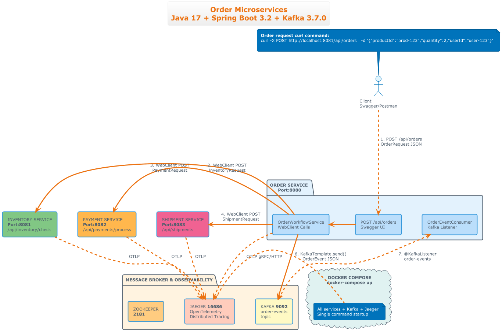
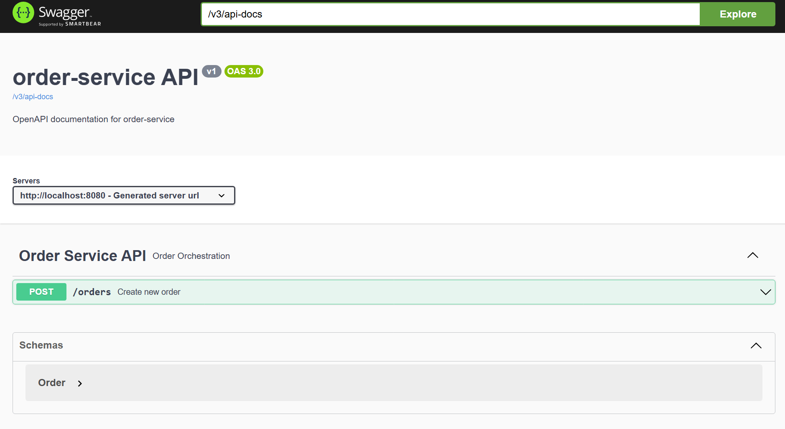
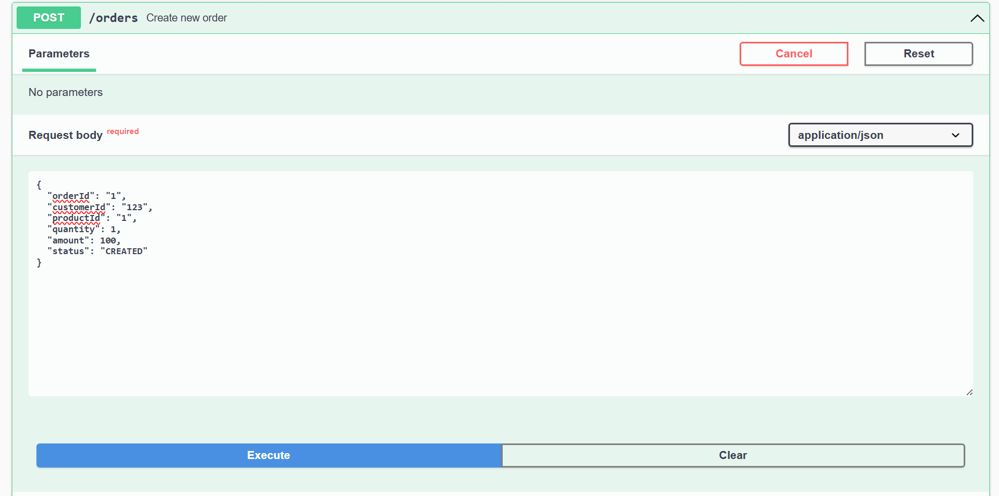
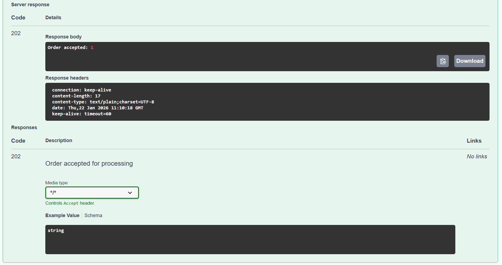

# Order Saga Microservices - Complete Reference Guide 🚀

Spring Boot 3.3+ Microservices with Saga Pattern, WebClient Orchestration, Kafka Events, Distributed Tracing & Full Observability

[](https://www.oracle.com/java/)
[](https://spring.io/projects/spring-boot)
[](https://spring.io/projects/spring-webflux)
[](https://www.docker.com/)
[](https://kafka.apache.org/)
[](https://www.jaegertracing.io/)
[](https://www.jenkins.io/)
[](LICENSE)

## 📋 Table of Contents

*   [Features](#features)
*   [Architecture](#architecture)
*   [Quick Start](#quick-start)
*   [Local Development](#local-development)
*   [API Documentation](#api-documentation)
*   [Distributed Tracing](#distributed-tracing)
*   [Log Correlation](#log-correlation)
*   [Production Deployment](#production-deployment)
*   [Troubleshooting](#troubleshooting)

## ✨ Features

| Feature              | Status | Description                                         |
| :------------------- | :----- | :-------------------------------------------------- |
| Saga Orchestration   | ✅     | OrderService coordinates Inventory/Payment/Shipment |
| WebClient Parallel   | ✅     | Reactive non-blocking parallel service calls        |
| Kafka Events         | ✅     | order-created → order-outcome event flow            |
| Distributed Tracing  | ✅     | Jaeger + OpenTelemetry + Micrometer                 |
| Log Correlation      | ✅     | TraceID/SpanID in all logs (grep traceId)           |
| OpenAPI/Swagger      | ✅     | Auto-generated API docs                             |
| Docker Compose       | ✅     | One-command deployment                              |
| Health Checks        | ✅     | /actuator/health endpoints                          |

## 🏗️ Architecture

```text
[Swagger UI] → POST /orders → [Order Service:8080]
                                    ↓ Kafka: order-created
                            [KafkaListener triggers Saga]
                                    ↓ WebClient (Parallel)
                    ┌──────────────┼──────────────┐
                    ↓              ↓              ↓
            [Inv:8081]    [Payment:8082]   [Ship:8083]
                    ↑              ↑              ↑
                    └──────────────┼──────────────┘
                                    ↓
                            [Aggregate Results]
                                    ↓ Kafka: order-outcome
                            [Jaeger:16686] ← Traces
```



**Key Patterns:**

*   **Saga Orchestrator:** OrderService coordinates 3 services
*   **Hybrid Communication:** Sync WebClient + Async Kafka
*   **Full Observability:** Logs + Traces + Metrics

## 🚀 Quick Start

**Docker (Production)**

```bash
docker compose up --build
```

**Local (No Docker)**

```bash
# Terminal 1: Kafka+Zookeeper
wget kafka && bin/zookeeper-server-start.sh && bin/kafka-server-start.sh

# Terminal 2-5: Services
mvn spring-boot:run -pl :order-service
mvn spring-boot:run -pl :inventory-service
mvn spring-boot:run -pl :payment-service
mvn spring-boot:run -pl :shipment-service
```

## 🌐 API Documentation

| Service       | Swagger UI                       | Health       |
| :------------ |:---------------------------------| :----------- |
| Order Service | `localhost:8080/swagger-ui.html` | `/actuator/health` |
| Inventory     | `localhost:8081/swagger-ui.html` | `/actuator/health` |
| Payment       | `localhost:8082/swagger-ui.html` | `/actuator/health` |
| Shipment      | `localhost:8083/swagger-ui.html` | `/actuator/health` |

**Test Order Creation**

```bash
curl -X POST http://localhost:8080/orders \
  -H "Content-Type: application/json" \
  -d '{
    "orderId": "test-123",
    "customerId": "cust-1",
    "productId": "prod-1",
    "quantity": 2,
    "amount": 250.0
  }'
```

**Expected:** "Order accepted: test-123"

## 🔍 Distributed Tracing

**Jaeger Setup**

```bash
docker run -d --name jaeger -p 16686:16686 -p 4318:4318 jaegertracing/all-in-one
```

Access: [http://localhost:16686](http://localhost:16686)

**Trace Flow**

```text
1. OrderService: POST /orders [150ms] ← Root Span
2.   └─ WebClient: Inventory [45ms]
3.   └─ WebClient: Payment [32ms]
4.   └─ WebClient: Shipment [28ms]
5.   └─ Kafka: order-outcome [12ms]
```

## 📊 Log Correlation

**Log Format**

```text
2026-01-22T16:10:23.123+05:30 INFO [order-service,A1B2C3D4E5F67890,kafka-test123]
  --- [reactor-http-nio-2] c.e.o.service.OrderServiceKafkaConsumer : WebClient completed
```

**Correlate by Trace ID**

```bash
# Copy traceId: A1B2C3D4E5F67890
grep "A1B2C3D4E5F67890" **/*.log

# Live tail
tail -f **/*.log | grep "A1B2C3D4E5F67890"
```

## 🛠️ Project Structure

```text
order-microservices/
├── services/
│   ├── order-service/          # Saga Orchestrator (8080)
│   ├── inventory-service/      # REST Target (8081)
│   ├── payment-service/        # REST Target (8082)
│   └── shipment-service/       # REST Target (8083)
├── docker-compose.yml          # Kafka + Jaeger
└── README.md
```

## 🔧 Configuration

**Critical Settings (All Services)**

```yaml
spring:
  application:
    name: order-service  # ← REQUIRED for [service-name] logs
management:
  tracing:
    sampling:
      probability: 1.0   # 100% tracing
logging:
  pattern:
    level: "%5p [${spring.application.name:},%X{traceId:-},%X{spanId:-}]"  # ← REQUIRED
```

**Kafka Topics**

*   `order-created`     # OrderService publishes
*   `order-outcome`     # Saga completion results
*   `inventory-result`  # Optional notifications
*   `payment-result`    # Optional notifications
*   `shipment-result`   # Optional notifications

## 🧪 Testing Scenarios

| Test Case       | Quantity | Amount | Expected Status |
| :-------------- | :------- | :----- | :-------------- |
| Success         | 2        | 250    | COMPLETED       |
| Inventory Fail  | 10       | 250    | FAILED          |
| Payment Fail    | 2        | 2000   | FAILED          |
| Shipment Fail   | 2        | 250    | FAILED (10% chance) |

## 📈 Observability Stack

| Tool    | URL                            | Purpose             |
| :------ | :----------------------------- | :------------------ |
| Swagger | `localhost:8080/swagger-ui.html` | API Testing         |
| Jaeger  | `localhost:16686`              | Distributed Tracing |
| Health  | `localhost:8080/actuator/health` | Service Status      |
| Metrics | `localhost:8080/actuator/prometheus` | Performance         |

## ⚙️ Technology Stack

*   **Backend:** Spring Boot 3.3.5 \| Java 17 \| Maven
*   **Messaging:** Apache Kafka 3.7.1
*   **Reactive:** Spring WebFlux \| WebClient
*   **Observability:** Micrometer \| OpenTelemetry \| Jaeger
*   **API:** SpringDoc OpenAPI 2.5.0
*   **Utils:** Lombok \| Spring Validation
*   **Infra:** Jenkins \| Docker Compose

## 🔄 Local Development Workflow

```bash
# 1. Kafka Setup
cd kafka_2.13-3.7.1
bin/kafka-topics.sh --create --topic order-created --bootstrap-server localhost:9092

# 2. Services (4 terminals)
mvn spring-boot:run -pl :order-service -am
mvn spring-boot:run -pl :inventory-service -am
mvn spring-boot:run -pl :payment-service -am
mvn spring-boot:run -pl :shipment-service -am

# 3. Test + Observe
curl POST /orders
tail -f **/*.log | grep traceId
localhost:16686
```

## 🐛 Troubleshooting

| Issue                 | Solution                                             |
| :-------------------- | :--------------------------------------------------- |
| `[unknown,,]` logs    | Add `spring.application.name`                        |
| No traceId            | Add `logging.pattern.level`                          |
| Kafka connection      | `localhost:9092` (local) vs `kafka:9092` (docker)    |
| No inventory logs     | `logging.level.com.example.inventory: DEBUG`         |
| WebClient timeout     | Check service ports `8081`/`8082`/`8083`             |

## 📸 Screenshots

1.  Swagger UI

    
    
    

2.  Jaeger Distributed Trace
3.  Log Correlation

    ```bash
    grep A1B2C3D4E5F67890 **/*.log
    ```
4.  Service Health

## 🎯 Business Value

*   **Fault Isolation:** Single service failure ≠ entire saga failure
*   **Full Observability:** Traces + Logs + Metrics
*   **Scalable:** Independent scaling per service
*   **Production Ready:** Health checks, tracing, validation
*   **Developer Friendly:** Swagger + Docker + Local run

## 🤝 Contributing
1. Fork repository
2. Create feature branch (`git checkout -b feature/amazing-feature`)
3. Commit changes (`git commit -m 'Add amazing feature'`)
4. Push (`git push origin feature/amazing-feature`)
5. Open Pull Request

**Free for commercial use, modification, and distribution**

MIT License

Copyright (c) 2026 Order Saga Microservices

Permission is hereby granted, free of charge, to any person obtaining a copy
of this software and associated documentation files (the "Software"), to deal
in the Software without restriction, including without limitation the rights
to use, copy, modify, merge, publish, distribute, sublicense, and/or sell
copies of the Software, and to permit persons to whom the Software is
furnished to do so, subject to the following conditions:

The above copyright notice and this permission notice shall be included in all
copies or substantial portions of the Software.

THE SOFTWARE IS PROVIDED "AS IS", WITHOUT WARRANTY OF ANY KIND, EXPRESS OR
IMPLIED, INCLUDING BUT NOT LIMITED TO THE WARRANTIES OF MERCHANTABILITY,
FITNESS FOR A PARTICULAR PURPOSE AND NONINFRINGEMENT. IN NO EVENT SHALL THE
AUTHORS OR COPYRIGHT HOLDERS BE LIABLE FOR ANY CLAIM, DAMAGES OR OTHER
LIABILITY, WHETHER IN AN ACTION OF CONTRACT, TORT OR OTHERWISE, ARISING FROM,
OUT OF OR IN CONNECTION WITH THE SOFTWARE OR THE USE OR OTHER DEALINGS IN THE
SOFTWARE.

Built with ❤️ for Production-Ready Microservices

January 2026 \| Spring Boot 3.3+ Saga Pattern Demo 🎉

[Test it now → See traces live → Production ready!] 🚀

## 👨‍💻 Author & Credits

**Built by Sibiponkumar Balaji**  
*Senior Software Engineer | Backend Engineering | Microservices | AWS* 